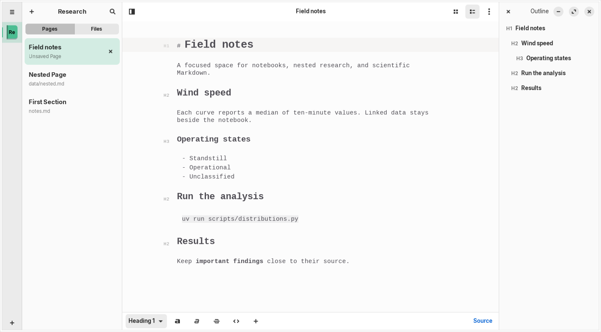
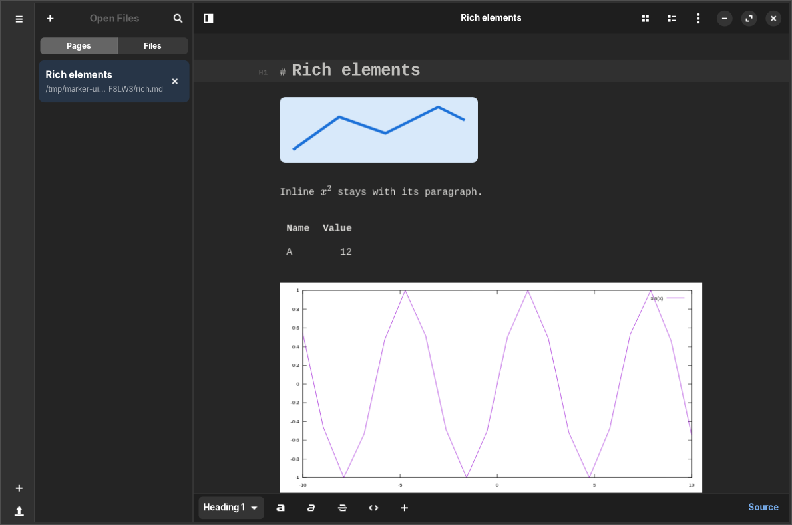

#  Marker

Marker is a Markdown editor for Linux. This [fork maintained by Pietro D'Antuono](https://github.com/pietrodantuono/Marker)
combines GTK 4 and libadwaita with Folio-inspired notebooks and scientific Markdown.
Documents remain ordinary Markdown files in folders you control.

- **Notebooks:** colored book icons, Pages/Files navigation, nested folders and search.
- **Five views:** Editor Only, Preview Only, Dual Pane, Dual Window and Formatted Markdown.
- **Formatted writing:** centered monospace text, heading controls, an outline and
  optional rendered images, equations, tables, gnuplot/Charter charts and Mermaid diagrams.
- **Scientific documents:** SciDown metadata, includes, references, captions,
  presentations and Charter plots; mathematics through KaTeX or MathJax.
- **Styles and export:** global themes, notebook-local CSS, HTML/PDF/LaTeX export
  and optional Pandoc office formats.

[Install](#install) · [Uninstall](#uninstall) · [Use Marker](#use-marker) ·
[Development](#development) · [Limitations](#limitations) · [Credits and license](#credits-and-license)

## Screenshots

Notebook navigation, formatted writing and the right-side outline in light mode:



Images, equations, tables and scientific charts rendered inside Formatted Markdown
in dark mode, with one page-wide Source/Render control:



## Install

Build this checkout to get the GTK 4 notebook redesign. Upstream distribution
packages and older releases may contain a different version.

### Get the source

The fork and its nested renderer submodules use SSH. Configure GitHub SSH access,
then clone all submodules together:

```bash
git clone --recurse-submodules git@github.com:pietrodantuono/Marker.git
cd Marker
```

For an existing checkout, synchronize the submodule URLs and initialize every level:

```bash
git submodule sync --recursive
git submodule update --init --recursive
```

The chain is Marker → SciDown → Charter → tinyexpr. Each submodule is pinned to
a commit; the commands above use those versions. Run the following build commands
from the repository root.

### Native installation with Meson

Native installation is supported. Use it when your system provides the development
libraries below; Flatpak is optional.

| Dependency | Requirement |
|---|---|
| Build tools | C compiler, pkg-config, Meson, Ninja, gettext, itstool |
| GTK | 4.14 or newer |
| libadwaita | 1.5 or newer |
| GtkSourceView | 5.12 or newer |
| WebKitGTK | 2.50 or newer, using the 6.0 API |
| Other libraries | GLib/GIO, libsoup 3, libspelling 0.2 or newer |

On Zorin OS 18 / Ubuntu 24.04, enable the normal updates repositories and install
the native build dependencies:

```bash
sudo apt update &&
sudo apt install build-essential git meson ninja-build pkg-config gettext itstool \
  libglib2.0-dev libgtk-4-dev libadwaita-1-dev libgtksourceview-5-dev \
  libwebkitgtk-6.0-dev libsoup-3.0-dev libspelling-1-dev
```

WebKitGTK must come from current distribution updates: the original Ubuntu 24.04
release shipped an older version. No GNOME upgrade or Flatpak SDK is required.

Check the installed development-library versions before building:

```bash
pkg-config --modversion gtk4 libadwaita-1 gtksourceview-5 webkitgtk-6.0 libspelling-1
```

Missing packages produce a `Package ... not found` error. Compare every reported
version with the table; having GTK 4 installed does not imply it is new enough.
Meson can fetch the pinned libspelling 0.2.1 fallback if the system library is
absent; building it also needs `libenchant-2-dev`, `libgirepository1.0-dev`,
`gobject-introspection`, `valac` and `gi-docgen`. Installing `libspelling-1-dev`
avoids that extra source build. Pandoc is optional for office export.

After initializing the submodules and installing compatible dependencies, use a
fresh build directory. An old GTK 3 `build` directory must not be reused:

```bash
meson setup build-native --prefix=/usr/local --buildtype=release &&
meson compile -C build-native &&
sudo meson install -C build-native
```

Install assets before running GUI/export tests, then validate and launch:

```bash
meson test -C build-native --print-errorlogs && marker
```

For subsequent updates, save your documents and close Marker, then run:

```bash
git pull --ff-only &&
git submodule sync --recursive &&
git submodule update --init --recursive &&
sudo meson install -C build-native
```

`meson install` rebuilds changed sources before installing. The default prefix
above requires your administrator password. If you install both native and Flatpak
versions, `marker` launches the native executable; `flatpak run` launches the
Flatpak version, which has a separate application profile.

### Local Flatpak (alternative)

Flatpak supplies GNOME 50 and the required libraries without upgrading your host's
GTK development packages. On Debian/Ubuntu, install the build tools:

```bash
sudo apt install flatpak flatpak-builder elfutils git
```

Add Flathub and install the runtime and SDK for your user:

```bash
flatpak remote-add --user --if-not-exists flathub \
  https://flathub.org/repo/flathub.flatpakrepo
flatpak install --user flathub org.gnome.Platform//50 org.gnome.Sdk//50
```

Build, install and launch:

```bash
flatpak-builder --force-clean --state-dir=build-flatpak-state \
  --repo=build-flatpak-repo build-flatpak com.github.fabiocolacio.marker.json
flatpak install --user build-flatpak-repo com.github.fabiocolacio.marker
flatpak run --user com.github.fabiocolacio.marker
```

Marker also appears in your application launcher. It can access notebook folders
in your home directory. Flatpak uses its own application profile; settings from
a native installation are not automatically imported.

To update, save your documents and close Marker. Pull changes and update submodules:

```bash
git pull --ff-only
git submodule sync --recursive
git submodule update --init --recursive
```

Rerun the builder command above, then replace the installed build:

```bash
flatpak install --user --reinstall build-flatpak-repo com.github.fabiocolacio.marker
```

## Uninstall

Save your documents and close Marker first. Use the instructions for the version
you installed; native and Flatpak installations are removed separately.

### Flatpak / Flathub

For a user installation from Flathub or the local Flatpak build:

```bash
flatpak uninstall --user com.github.fabiocolacio.marker
```

For a system-wide installation, replace `--user` with `--system`.
This keeps the app's settings and data, including notebook folders.

To also delete your Flatpak app profile, settings and cache, use this instead:

```bash
flatpak uninstall --user --delete-data com.github.fabiocolacio.marker
```

Files inside the app's data directory are deleted with `--delete-data`. Notebook
folders stored elsewhere, such as in Documents, are kept.

### Native Meson installation

From the original repository and build directory used to install Marker:

```bash
sudo ninja -C build-native uninstall
```

Replace `build-native` with `build` if that was your installation's build directory.
Keep that directory and its `meson-logs/install-log.txt` until uninstall finishes:
Meson uses the log to remove the files it installed.

For the `/usr/local` prefix used in this guide, refresh the shared desktop caches
after uninstalling:

```bash
sudo glib-compile-schemas /usr/local/share/glib-2.0/schemas &&
sudo gtk-update-icon-cache -f -t /usr/local/share/icons/hicolor &&
sudo update-desktop-database /usr/local/share/applications
```

Use your actual installation prefix if you chose another one. For a user-owned
prefix, omit `sudo`. Uninstall keeps your settings, cache, notebook folders and
build dependencies.

## Use Marker

### Open a notebook and add pages

Use the **+** control in the notebook rail to create or open a notebook, or choose
**Open… → Open Notebook…** in the main menu. A notebook is a folder, so existing
Markdown, images and data files stay together.

Select a book icon, then use **New Page** in the page sidebar. **Pages** lists
Markdown documents and open drafts. **Files** browses nested assets and stylesheets.
The search control filters the active navigation mode. Standalone documents remain
available under **Open Files**.

Right-click or long-press a notebook to edit its name, icon and color, reveal its
folder, change its rail order or remove it from Marker. **Remove** preserves the
folder and asks how to handle unsaved documents. Renaming a notebook changes its
display name, not its folder name.

### Write with rendered elements

Choose **Formatted Markdown** from the document's view-mode control. Headings show
H1–H6 gutter markers; the formatting toolbar includes a heading-level chooser.
The **Outline** control opens the heading list on the right. Navigation and outline
become overlays when the window is narrower.

Images, equations, tables, gnuplot/Charter charts and Mermaid diagrams render in the
writing page. The button at the right end of the formatting toolbar switches the
**whole page** between **Source** and **Render**. Click **Source** (or a rendered
element) to show raw Markdown and stop scientific evaluation, including hidden
preview workers and data monitoring. This is useful while editing expensive plots.
Click **Render** to resume using the current source, preferences and notebook styles.
The choice stays with the open document when changing views. Newly opened Markdown
documents start with Render selected in Formatted mode. Editing, undo and saving use
the same Markdown buffer.

In Render, caret movement, search and selection into a rendered region can also
expose that region's source temporarily; inline images/equations use their containing
paragraph. Use the page-wide **Source** control to keep all source visible.

In **Preferences → Preview**, enable mathematics, Mermaid, gnuplot and Charter as
needed. Mathematics supports the selected KaTeX or MathJax backend, including inline,
display and fenced equations. Local MathJax uses the installed system runtime when
available, with a bundled offline fallback. Gnuplot uses fenced `gnuplot` blocks and
can load relative CSV, DAT and TXT files. Changes to linked data refresh charts in
Render. Missing images or failed renders leave editable source with an explanation;
switch to Source, correct the problem and choose Render to retry.

Print and export render explicitly even while the writing page is in Source, so
the saved output can still contain scientific figures.

### Set notebook styles

Open the notebook title menu and choose **Edit Notebook Styles**. Marker creates
`.marker.css` at the notebook root if it is absent and opens it in CSS source mode.
Save your edits to refresh the notebook's previews and inline rendered elements.
The stylesheet appears under **Files**, rather than **Pages**.

Normal notebook CSS rules override renderer defaults, the global preview theme
and font/color preferences. CSS `!important` follows standard layer semantics.
Stylesheet-relative URLs resolve from the notebook, and HTML/PDF export uses the
same effective style cascade.

### Save and export

Save is available when a document has unsaved changes. The document overflow menu
contains **Save As**, **Export** and **Print**, alongside source search and window
options. HTML, PDF and LaTeX export are built in. DOCX, ODT and RTF need Pandoc;
the local Flatpak manifest does not bundle it, so those formats require Pandoc
inside the app's environment.

## Development

To build without changing host libraries, open a GNOME 50 SDK shell from the
repository root:

```bash
flatpak run --filesystem="$PWD" --command=sh org.gnome.Sdk//50
```

Run these commands **inside the SDK shell**:

```bash
meson setup build-sdk --prefix="$PWD/build-sdk/install"
meson compile -C build-sdk
meson install -C build-sdk
meson test -C build-sdk --print-errorlogs
exit
```

GUI tests need a display and installed assets; unavailable display checks report
skips. Run SDK-built binaries in that SDK environment. Use the local Flatpak build
for a desktop installation.

See [CONTRIBUTING.md](CONTRIBUTING.md) for coding conventions. The persistent
[feature specification](.codex/FEATURE.md), [plan](.codex/PLAN.md),
[tasks](.codex/TASKS.md), [decisions](.codex/DECISIONS.md) and
[progress](.codex/PROGRESS.md) record the redesign and its validation.

## Limitations

- Inline rendered regions are visual snapshots. Use regular preview for links
  and interactive chart controls; clicking an inline region opens its source.
- Complex list/quote nesting keeps source presentation. Oversized documents exceed
  the 64 MiB snapshot readback budget and fall back to source; regular preview remains available.
- Exported HTML keeps local stylesheet and asset references. Keep those files
  alongside the export when moving it. Notebook CSS parity applies to HTML/PDF,
  rather than LaTeX or Pandoc office formats.
- Native desktop chooser, file-manager and physical-printer checks, plus Debian
  package builds, remain documented validation follow-ups in the tracking files.

## Credits and license

Marker was created by **[Fábio Colácio](https://github.com/fabiocolacio)**.
This fork builds on [the original Marker project](https://github.com/fabiocolacio/Marker)
and the work of Martino Ferrari and the Marker community. Thank you for the editor
and scientific-document foundations that make this continuation possible.

The notebook interface is inspired by [Folio](https://github.com/toolstack/Folio).
Book geometry and notebook symbols are credited in [the icon attribution](src/resources/icons/ATTRIBUTION.md).
Scientific rendering uses [SciDown](https://github.com/Mandarancio/scidown),
[Charter](https://github.com/Mandarancio/charter) and [gnuplot](https://www.gnuplot.info/).
The app also uses KaTeX/MathJax, Mermaid and highlight.js.

Marker's application code is distributed under the **GNU General Public License,
version 3**; see [LICENSE.md](LICENSE.md). Bundled third-party components retain
their own licenses and are not all covered by Marker's GPL license.

The bundled gnuplot WebAssembly runtime runs as a separate command-line program
inside a Web Worker, receiving plot scripts/data and returning SVG output. Gnuplot
uses its own [redistribution license](data/scripts/gnuplot/Copyright), rather than
the GPL. Its [provenance and third-party notices](data/scripts/gnuplot/THIRD_PARTY_NOTICES.md)
record the unmodified upstream source release and accompanying runtime licenses.
Preserve these notices when redistributing Marker. Changes to gnuplot's own source
must meet its additional modified-version requirements, including distributing
patches alongside binaries and identifying the modified version and its maintainer.
